# Использование админки для загрузки аудиофайлов  
  
Введите свои логин и пароль для входа в админку  
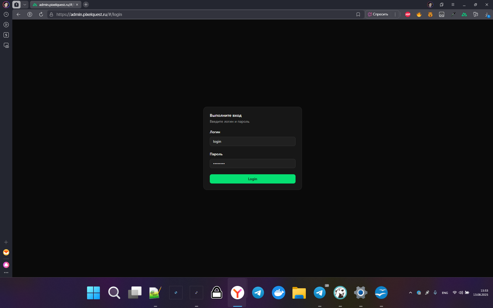

Перед вами откроется панель администратора. В меню слева можно выбрать интерсующий вас раздел(Аудиосеты)  

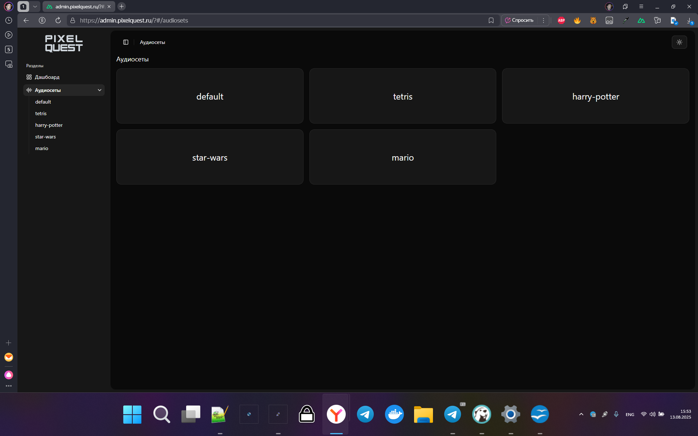

Когда вы окажетесь в меню сетов, вам предстанет список аудиофайлов для конкретной аудиотемы и конкретного префикса  

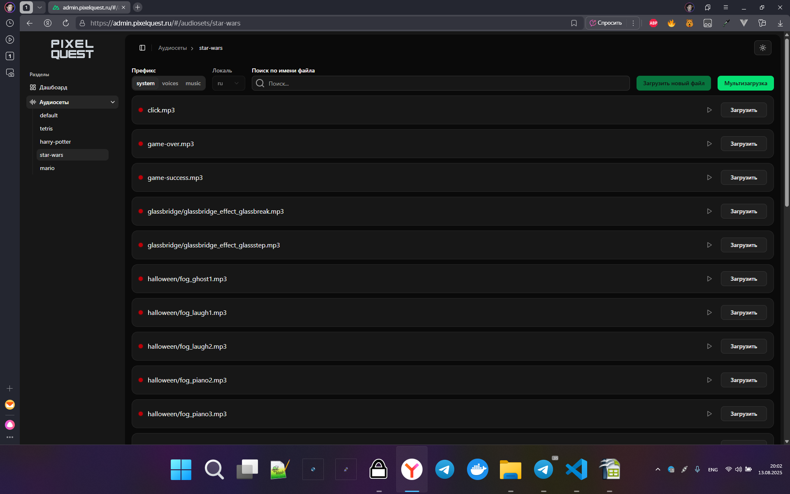

Функция загрузки НОВОГО файла доступна только для темы default. Так же можно загружать музыку для префикса music в рамках любой аудиотемы  

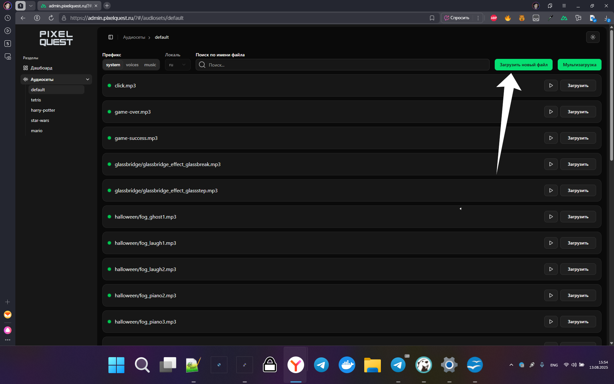

После выбора файла нужно указать полный путь к нему внутри префикса. Например, tower-defence/teleport.mp3 для соответствующего звука в префиксе system  

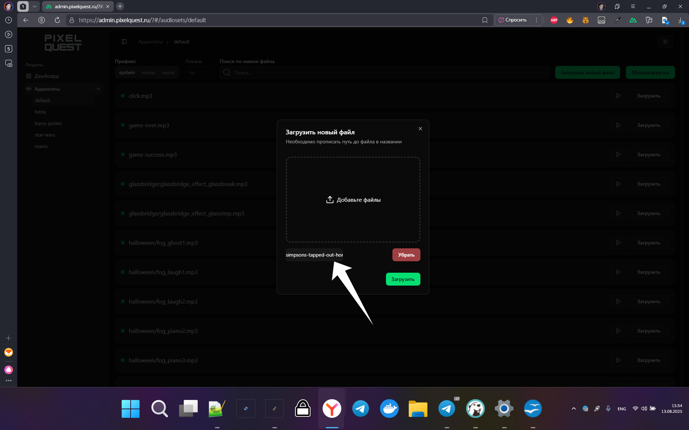

Так же можно перезаписывать файлы, которые уже существуют. Особенно это полезно для загрузки непредставленных в теме файлов(обозначено красным).  

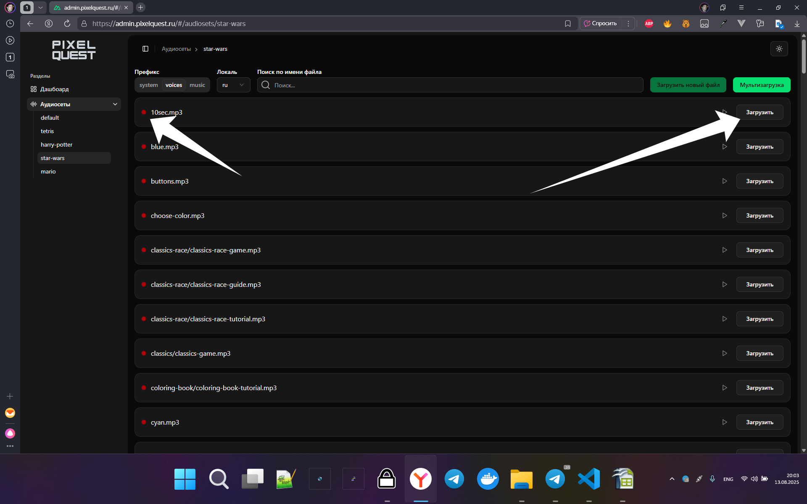  

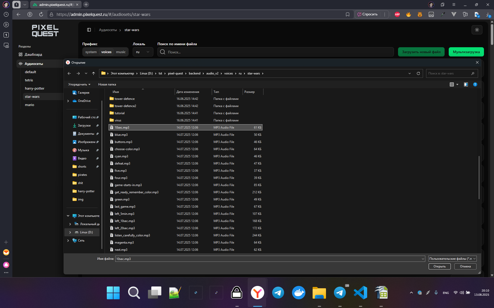  

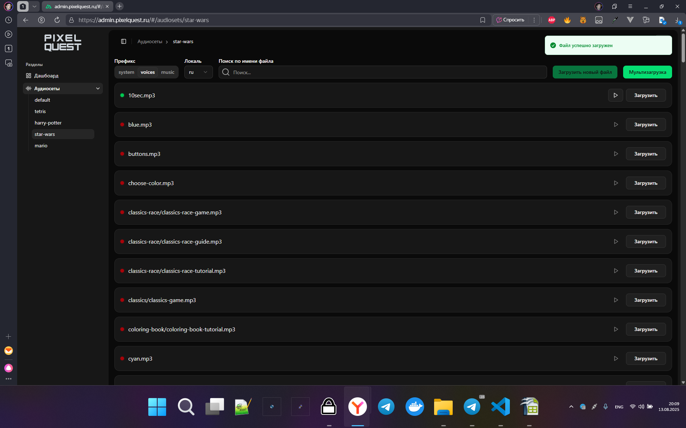

Кроме того, представлена возможность мультизагрузки множества звуков для конкретной аудиотемы  

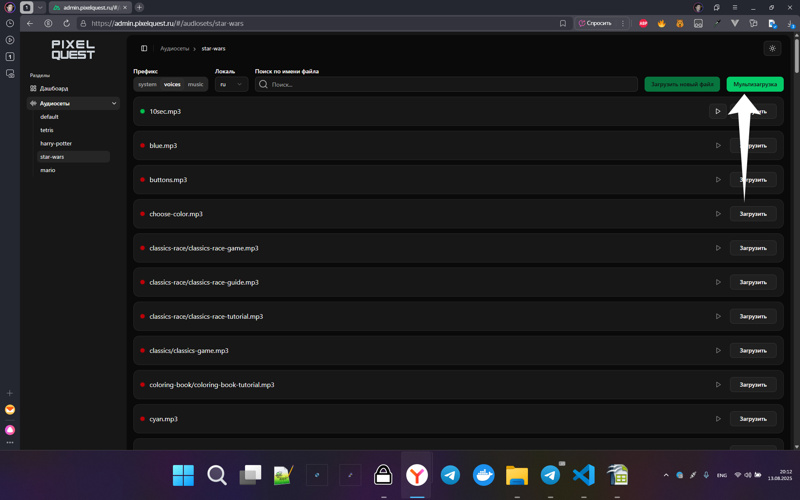  

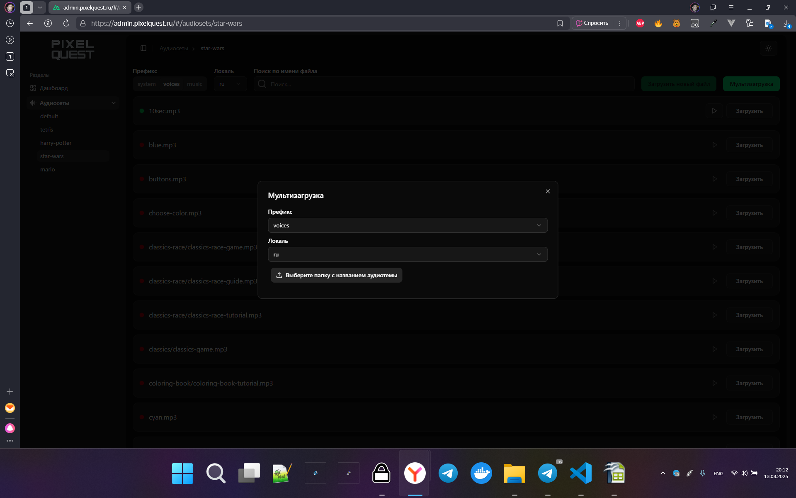  

Нужно выбрать папку, в которой находятся звуки для указанного префикса, например - папка с голосами для аудиосета Star-wars  

  

После выбора папки вам предстанет список файлов на загрузку(обратите внимание, программа не даст загружать файлы, которые не представлены в теме default, т.к. она является источником правды)  

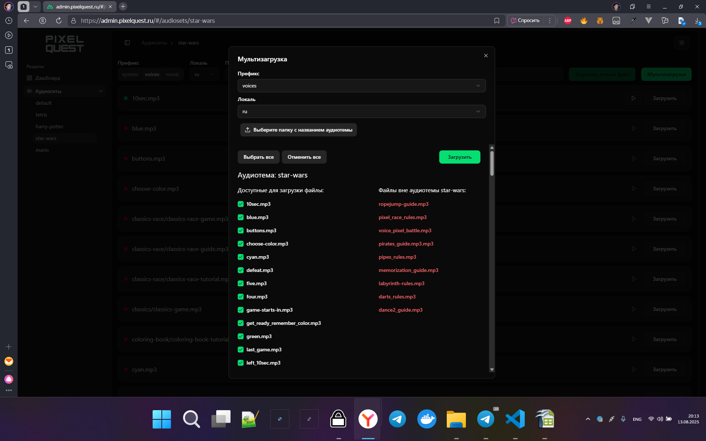